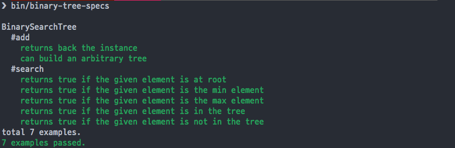

# Timed Message Scheduler Library

[](https://travis-ci.org/kigster/timed-messages)

This library uses CMake and a CCSpec project for automated tests.

#### CMake/C++ Project Template with CCSpec as Submodule

This project is a derivative of [ccspec-example](https://github.com/zhangsu/ccspec-example/) project, however this repo fixes some compilation and build issues in the original repo.

It provides a simple C++ project template that integrates with the [ccspec](https://github.com/zhangsu/ccspec) unit testing library, however we are using an [updated fork](https://github.com/kigster/ccspec), which itself is a fork of [this fork](https://github.com/simonwu-os/ccspec) which fixes coloring and other nuances.

#### See Also

 * [CMake Project Template](https://github.com/kigster/cmake-project-template) project that uses the [Google Test Library](https://github.com/google/googletest).


## Prerequisites

 1. Please install XCode Tools: `xcode-select --install`
 2. Install HomeBrew — following [instructions here](https://brew.sh).
 3. Install CMake — `brew install cmake`,
 4. Install `direnv` — `brew install direnv`, and then `echo 'eval "$(direnv hook bash)"' >> ~/.bashrc`

Now, start a new terminal so that it will load `direnv`, and `cd` into the project folder.

You should see the following warning message:

```
> cd ~/cmake-ccspec-template
direnv: error .envrc is blocked. Run `direnv allow` to approve its content
> 
```

This is normal. To fix this, run the following command:

```bash
direnv allow .
```

From now on, `sbin` and `bin` folders inside the project will be automatically in your PATH anytime you enter the project.

## Usage

Ensure you have `git` command installed, and then run:

```bash
$ git clone https://github.com/kigster/cmake-ccspec-template
$ cd cmake-ccspec-template
```

### Using Automated Build

You can use the provided BASH script `sbin/build` to build and run all the tests.

Examples (NOTE: we run `build` without `sbin/build` because of the `direnv` setup we did earlier.' If you skipped this part, you will need to change `build` with `sbin/build` below:

```bash
$ build
$ build build
$ build run
$ build clean
```

### Manual Build

Start by initializing ccspec git submodule. This step is crucially important, as it pulls the `ccspec` library into the project.

```bash
$ git submodule init && git submodule update
```

Next we can use standard CMake semantics to build our project:

```bash
$ mkdir -p build && cd build
$ cmake ..
$ make -j 4 
$ make install
$ cd ..
```

This should build all dependencies, and then you can run the tests:

```bash
$ bin/message-scheduler-specs
```

You should see something like the following output:



## Acknowledgements

*People:*

 * [Su Zhang (張甦)](https://github.com/zhangsu)
 * [simonwu-os](https://github.com/simonwu-os)

*Repos:*

 * [ccspec original](https://github.com/zhangsu/ccspec)
 * [ccspec original example](https://github.com/zhangsu/ccspec-example/)
 * [ccspec fork](https://github.com/simonwu-os/ccspec)
